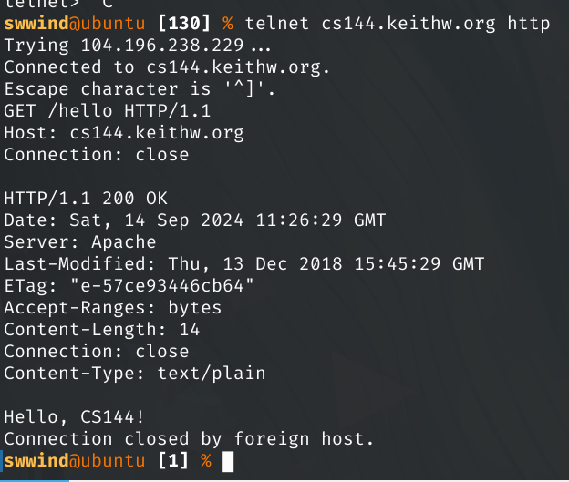
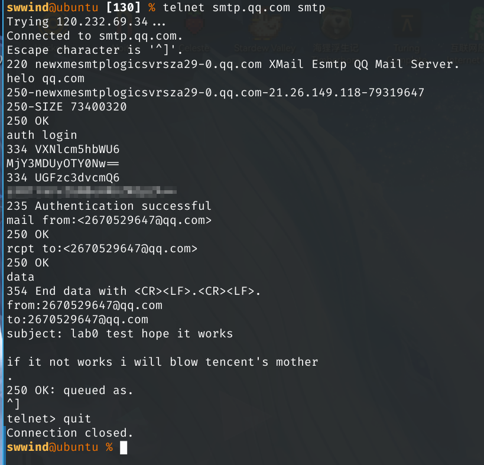
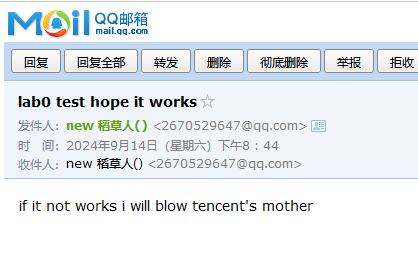
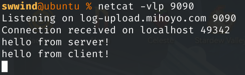
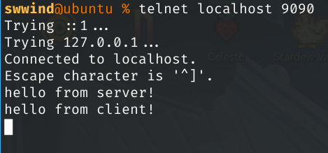
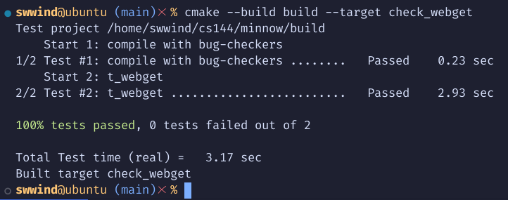
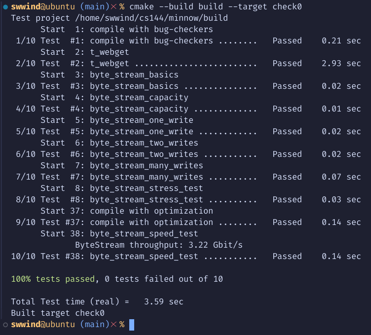

# Report

## Task 1

## Task 2

## Task 3, 4

### (a) Program structure and Design

Nothing much to elaborate here. Just the most simple code and it just runs.

As for ByteStream, we add `count_`, `done_` to save the current state and use `std::string buffer_` as the storage of the read/write stream. Functions are just implemented as-is.

### (b) Implementation Challenges

The most challenging thing is to upgrade my ubuntu 22.04 to 24.04 and afterwards I can have the correct cmake version to compile the code! The lab is just about read the code and use the exisiting frameworks. Nothing hard to debug.

Btw, I prefer C more than C++.

### (c) Remaining Bugs

No bugs remaining.

### (d) Experimental results and performance

3.22Gbps is the best I can make.

