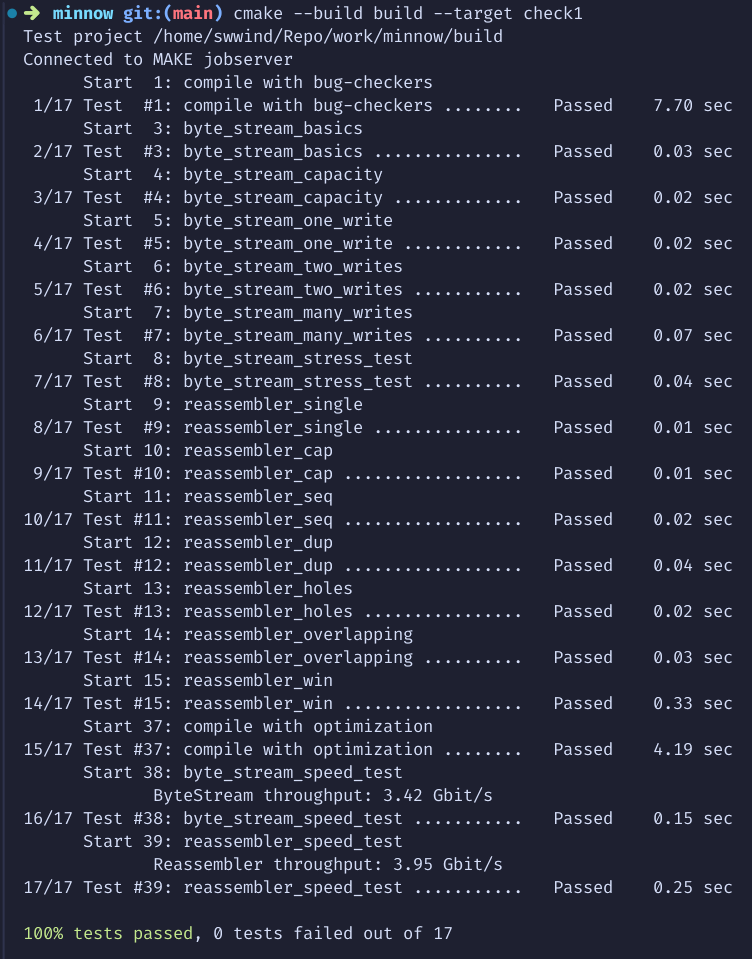

# Report

## (a) Program structure and Design

The Reassembler is designed to handle out-of-order byte segments and reassemble them into a contiguous stream that is written to a `ByteStream`. It tracks the segments of data that have arrived, stores them, and writes them to the `ByteStream` when the data is in order and space is available.

Key components include:

- **Buffer**: The data is temporarily stored in two main structures:
  - `buffer_slots_`: A `std::set` of ranges representing free buffer slots available for incoming segments.
  - `buffer_`: A `priority_queue` that holds incoming data, sorted by the segment's start index, ensuring the lowest index is processed first.
- **Indexes and Flags**:
  - `current_`: Tracks the current byte index that the reassembler is expecting next.
  - `last_`: Marks the index after the last byte when the last segment is received.
  - `pending_`: Tracks the number of bytes that are stored in the buffer but have not yet been written to the `ByteStream`.
  - The algorithm ensures that all operations respect the capacity of the output stream and the available buffer space.

The logic optimizes for handling overlapping data segments and efficiently assembling contiguous data for output.

The average time complexity is $O(N\log N)$, and the space complexity is $O(N)$.

## (b) Implementation Challenges

Several challenges were addressed in this implementation:

1. **Handling out-of-order segments**: Incoming data segments may not arrive in order, so the system needs to identify gaps, handle overlapping segments, and only write to the `ByteStream` when data is contiguous.
2. **Efficient memory management**: The program manages buffer slots efficiently using a `std::set` to track ranges of available memory, which allows quick updates when segments are added or removed. Overlapping segments need to be merged or split as they are inserted into the buffer.
3. **Capacity management**: The `Reassembler` needs to respect the capacity of the `ByteStream` writer, therefore we need some magic to get the value of `capacity_` from `ByteStream` (which is a protected property).
4. **Edge case handling**: Handling edge cases like empty data strings, segments that overlap with existing buffer entries, and the final segment flag (`is_last_substring`) required careful attention to avoid bugs such as incomplete or premature stream closure.
5. **C++ Language sh\*ts**: If I was to accidentally use `auto w = reader().writer();` (without the reference), it would create a copy of the `ByteStream` object, meaning all subsequent operations would be applied to this copy rather than the original stream. This sh\*t makes me debug for a quite few hours.

## (c) Remaining Bugs

There are no remaining bugs because my code passes the check1 test. (Unless the test is fake)

## (d) Experimental results and performance

By running `cmake --build build --target check1` we can get the results as Figure. 1 shows.

`ByteStream` supports maximum $3.42 \text{ Gbps}$ transmission rate, and `Reassembler` supports maximum $3.95 \text{ Gbps}$ transmission rate on my machine.
