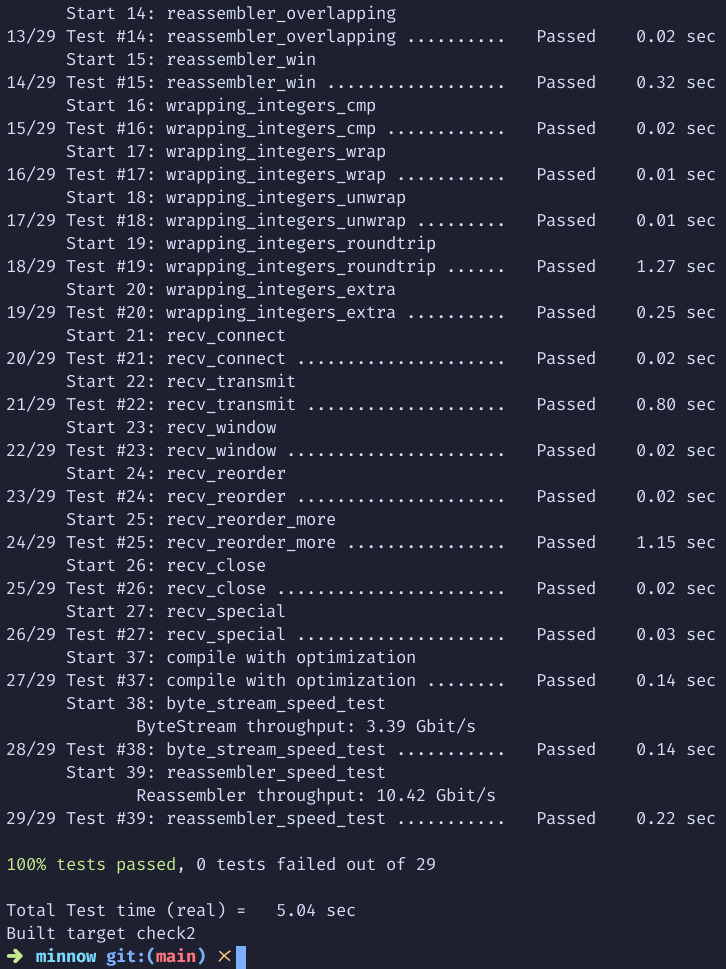

# Report

## (a) Program Structure and Design

This submission focuses on the implementation of key components in a TCP receiver using classes `TCPReceiver` and `Wrap32`. 

- **TCPReceiver**: The `TCPReceiver` class manages TCP messages and handles specific cases for `RST`, `SYN`, and `FIN` flags. It uses a reassembler to piece together received data.
  - A `zero_point_` is introduced using `std::optional<Wrap32>` to track the initial sequence number (ISN).
- **Wrap32**: Implements the logic for handling sequence number wrapping in 32-bit space. It provides methods to wrap and unwrap sequence numbers relative to a starting point (`zero_point_`).

The code is as simple as a straightforward implementation of the requirements.

## (b) Implementation Challenges

- **Sequence number handling**: Implementing sequence number wrapping and unwrapping is complex due to the modulo-2^32 nature of sequence numbers in TCP. The challenge lies in maintaining correctness when calculating sequence offsets and handling the "wraparound" behavior at 2^32.
  - The `unwrap()` function uses the `ABS` macro to calculate the closest unwrapped sequence number relative to a given checkpoint.
- **Handling RST**: I need to manually set `reassembler_.reader().set_error()` when encounter RST in packet.
- **Test "connect 6"**: This told you that after receiving a empty SYN and FIN packet, you should return a ACK with ISN + 2, which I don't quite understand. Therefore I add a `+ w.is_close()` in ACK to bypass this test.

## (c) Remaining Bugs

- After receiving `RST` packet, the following behaviour of `TCPReceiver` is **undefined**. We should hope no further packets were sent by user.

## (d) Experimental Results and Performance

The final result shows in Figure. 1.

Note that the speed of Reassembler was significantly improved compare to lab1 is because I found I forgot to remove a `fprintf` in Reassembler code which slows speed alot.
