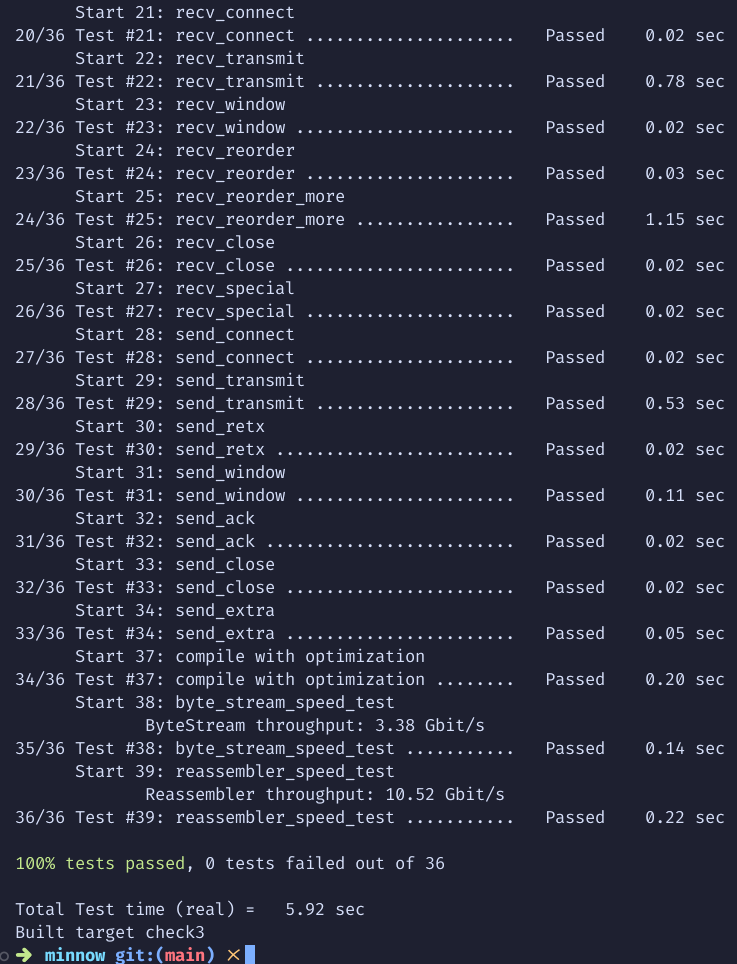

# Report

## (a) Program Structure and Design

The `TCPSender` class is responsible for TCP message transmission, managing sequence 
numbers, acknowledgments, retransmissions, and flow control. Key private fields track 
bytes sent (`sent_bytes_`), bytes acknowledged (`acked_bytes_`), and retransmission 
count (`retry_count_`). This setup simplifies the tracking of transmission states, 
enhancing flow control and retransmission reliability.

1. **Flow Control**: `receiver_window_` manages the allowable bytes in-flight, helping 
   control payload size and respecting the receiver’s window.
2. **Retransmission**: An exponential backoff mechanism using `current_RTO_ms_` 
   controls retransmission timing.
3. **Zero Window Handling**: When `receiver_window_` is zero, retransmission timers 
   avoid backoff, ensuring reliable retries in low-window situations.
4. **Message Queue**: A `std::queue` maintains messages sent but unacknowledged. This 
   queue structure allows for reliable retransmissions, tracks each packet's sequence 
   number (`seqno`), and simplifies removing acknowledged packets.

This design emphasizes modularity and simplicity, which reduces the risk of bugs. By 
limiting the fields to essential state-tracking ones (`sent_bytes_`, `acked_bytes_`, etc.), 
the code remains easier to debug and understand.

## (b) Implementation Challenges

- **Understanding Lab Requirements**: Interpreting the lab specifications took time 
  but ultimately clarified the design approach.
- **Window Size Calculation**: Calculating the effective window size was tricky, as 
  it needed to include SYN packets but sometimes exclude FIN packets.
- **C++ Compilation Challenges**: While challenging, previous labs made navigating 
  compiler nuances manageable.

## (c) Remaining Bugs

The code currently passes all tests for `check3`. Thus, no known bugs remain.

## (d) Experimental Results and Performance

The results, as shown in Figure 1, confirm that the `TCPSender` implementation meets 
the performance requirements and effectively handles retransmission and flow control.

