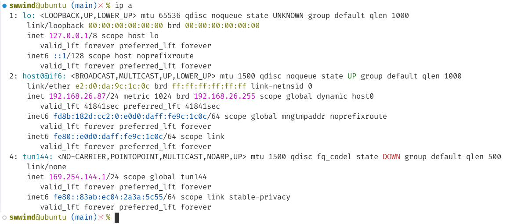
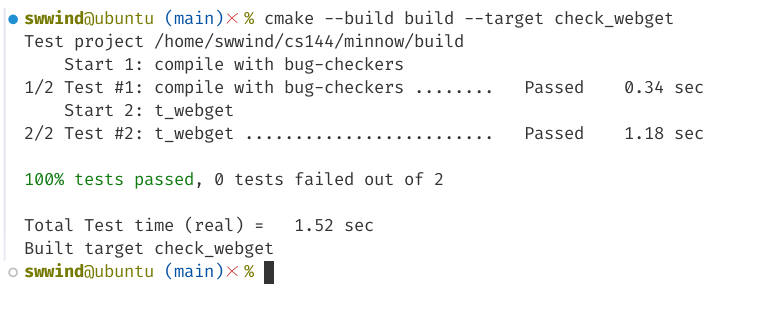
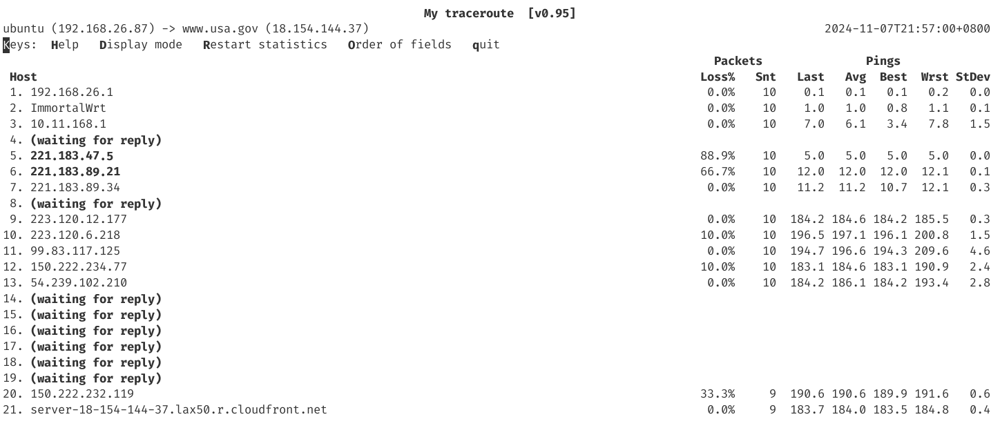

# Report

## Preliminaries

After starting tun device, we can see the interface in Figure 1.

Running \verb|check_webget| just passed without any problem, as shown in Figure 2.

Next, we try to analyze data from \verb|www.usa.gov|, we first using \verb|mtr| to test link route, the result is shown in Figure 3.

## Analyze data

We pinged \verb|www.usa.gov| for about 2 hours.

1. We have sent total $41270$ requests, while $1358$ were lost and $39912$ were received.
   
   The overall delivery rate were $39912 / 41270 = 96.71\%$.

2. The longest consective successful pings were $592$.
3. The longest burst of losses were $3$.
4. We have $\text{Pr}[\text{success} | \text{success}] = 96.75\%$, and $\text{Pr}[\text{success} | \text{loss}] = 95.58\%$. They are almost the same comparing to overall delivery rate.
5. Minimum RTT is $182.0 \text{ ms}$.
6. Maximum RTT is $373.0 \text{ ms}$.
7. The graph of RTT over time was shown in Figure 4.

   {width=70%}

8. The graph of cumulative distribution function of RTT is shown in Figure 5.

   {width=70%}

9. The graph of correlation of RTT is shown in Figure 6.

   {width=70%}

10. By observing the RTT over Time graph, we find that the majority of the RTT values are tightly clustered between 175 ms and 225 ms, indicating that the usual latency is relatively stable within this range. This narrow range shows a consistently low RTT under typical network conditions. Besides, there are intermittent spikes reaching up to 375 ms. These spikes occur throughout the time period but are not frequent. The spikes suggest occasional latency increases, possibly due to transient network congestion or routing changes.
    
    By observing the cumulative distribution of RTT graph, we find that the cumulative probability reaches nearly 100% by the time RTT values reach around 250 ms. This indicates that almost all RTT measurements are below 250 ms, with only a small fraction extending beyond this point.

    By observing the correlation of RTT graph, we find that the densest cluster of points lies around the 200 ms mark for both axes. This suggests that when RTT is low for one ping, it tends to be low for the subsequent ping as well, indicating stable network conditions with low latency for consecutive pings. Besides, there is a noticeable diagonal trend where points align roughly along the line $y=x$. This indicates that when a ping has a higher-than-average RTT, it’s likely that the following ping will also have a higher RTT. This pattern suggests a level of correlation between consecutive RTTs, meaning that network conditions affecting one ping (like temporary congestion) often persist long enough to affect the next.

    In conclusion, the network is generally stable with a high delivery rate (96.71%) and low, consistent RTT (~200 ms). Occasional, brief spikes in RTT (up to 375 ms) indicate rare, transient delays. RTT values show moderate correlation over consecutive pings, suggesting short-lived bursts of latency without prolonged issues.
