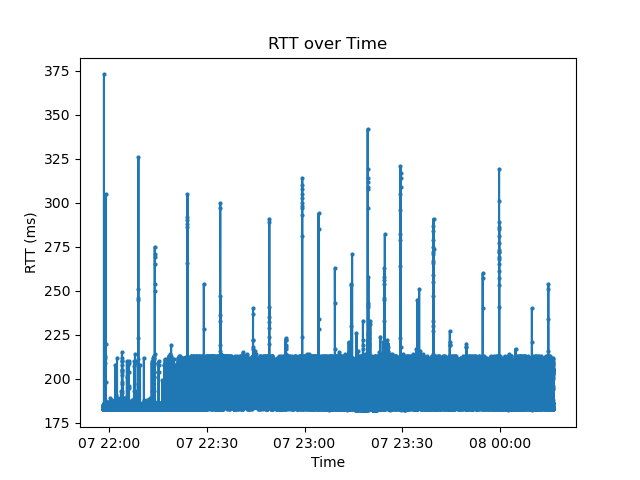
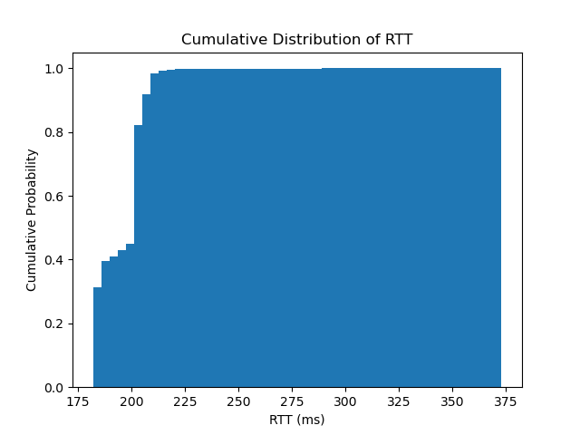
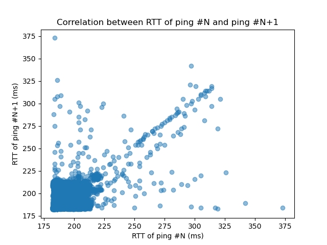

# Report

## Preliminaries

## Analyze data

We pinged \verb|www.usa.gov| for about 2 hours.

1. We have sent total $41270$ requests, while $1358$ were lost and $39912$ were received.
   
   The overall delivery rate were $39912 / 41270 = 96.71\%$.

2. The longest consective successful pings were $592$.
3. The longest burst of losses were $3$.
4. We have $\text{Pr}[\text{success} | \text{success}] = 96.75\%$, and $\text{Pr}[\text{success} | \text{loss}] = 95.58\%$. They are almost the same comparing to overall delivery rate.
5. Minimum RTT is $182.0 \text{ ms}$.
6. Maximum RTT is $373.0 \text{ ms}$.
7. The graph of RTT over time was shown in Figure. 1.

   

8. The graph of cumulative distribution function of RTT is shown in Figure. 2.

   

9. The graph of correlation of RTT is shown in Figure. 3.

   
