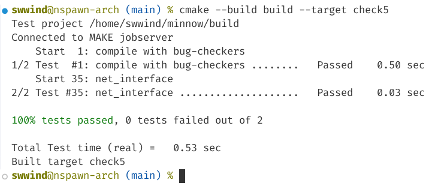

# Report

## (a) Program Structure and Design

We use a `unordered_map` with key of ipv4 address and value of struct `ARPState` to manage everything related to specific ipv4 address, including:

- `found`: is the ARP record found or not.
- `request`: timeout before sending a next ARP request.
- `expire`: timeout before ARP expires.
- `eth_address`: the ARP record if found.
- `cache`: vector of messages that pending ARP request to resolve.

We also use some helper functions for better coding:

- `update_arp()`: Updates the ARP `cache` when a new mapping is received, sends any queued datagrams to the resolved address, and clears the `cache` for that IP.
- `send_ipv4()`: Encodes and sends an IPv4 datagram within an Ethernet frame.
- `send_arp()`: Encodes and transmits an ARP message within an Ethernet frame.

Other implementation is written as-is.

## (b) Implementation Challenges

- Caching is required if ARP is not resolved, which requires additional memory usage.
- Managing queued datagrams for unresolved ARP addresses required careful design to ensure datagrams are sent only after resolution.

## (c) Remaining Bugs

- Cache may exist forever if ARP is never resolved. However we don't need to mind this situation in this lab, and so as other edge situations.

## (d) Experimental Results and Performance

The test runs every fast!

