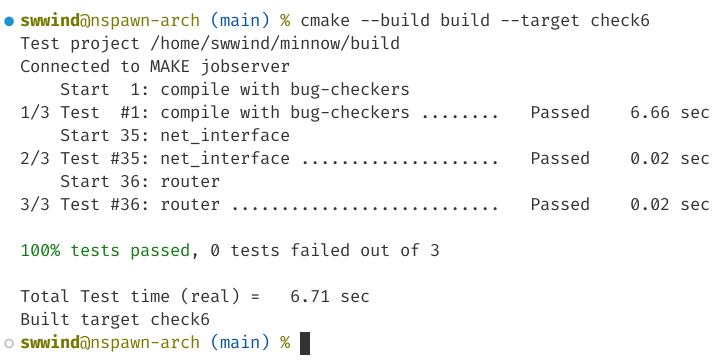

# Report

## (a) Program Structure and Design

- We use `struct Route` to discribe the routing rule.
- Convert `prefix_length` into `subnet_mask` in rules may slightly speed up routing.
- Routing table is sorted before routing, this makes sure the longest prefix will match first in for-loop.

## (b) Implementation Challenges

- Fixed a bug in prior lab5, where I should push IPv4 package into cache before sending ARP request. The test is kind of weird, when you sending an ARP request, you will receive the response before leaving the sending function. This spend me a lot of time to debug.
- Note that, change TTL also needs to re-compute checksum in header. Otherwise the datagram will be dropped as bad.

## (c) Remaining Bugs

- Hopefully none.

## (d) Experimental Results and Performance

It works!

